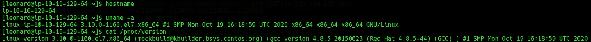
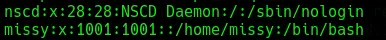
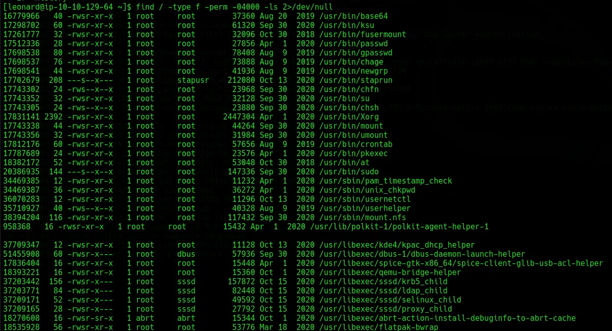
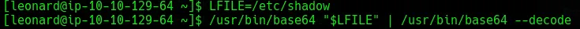
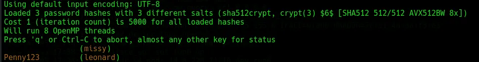
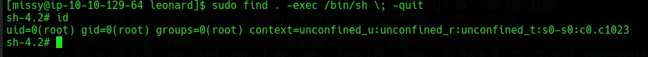

# Linux Privesc Challenge

The URL for this room is: https://tryhackme.com/room/linprivesc.

# Recon

Recon in this room will be different (no NMAP!) because we are given SSH credentials for a low-level user immediately. Once we’re in we can grab some basic system info with `hostname`, `uname -a` and `cat /proc/version`. 

*Fig I. Output from system info commands.*

A bit of Googling and nothing pops out straight away. I tried `sudo -l` but no luck for our user there either. We can read `/etc/passwd` which gives us another user — `missy` . 

*Fig II. The Missy user in /etc/passwd.*

Knowing this I run a check to see there are any easy exploitable SUID binaries floating around we can use to read `/etc/shadow`. 

*Fig III. Output of search for SUID binaries.*

What sticks out here is `/usr/bin/base64`, I know we can use this to read out files very easily.

# Privilege Escalation

To exploit the `base64` SUID bit being set we can use the commands in the screenshot, this will let us read out any file, including `/etc/shadow`. 

*Fig IV. Commands to read /etc/shadow using base64.*

With both `/etc/passwd` and `/etc/shadow` we can try to crack some of the passwords to see if any other users have better privilege escalation vectors. Unshadowing these with `unshadow passwd.txt shadow.txt > unshadow` lets us run `john --wordlist=/usr/share/wordlists/rockyou.txt unshadow` — this gets us the password for the other user `missy`. 

*Fig V. The output of running John against the unshadowed file.*

Switching to the `missy` user and immediately trying `sudo -l` shows us that `missy` can execute the `find` command as sudo. GTFOBins shows us a way to run `find` as superuser and maintain privileges. 

*Fig VI. Running GTFOBins exploit for find to get root.*

Now we are root, finding the two flags should be easy enough!