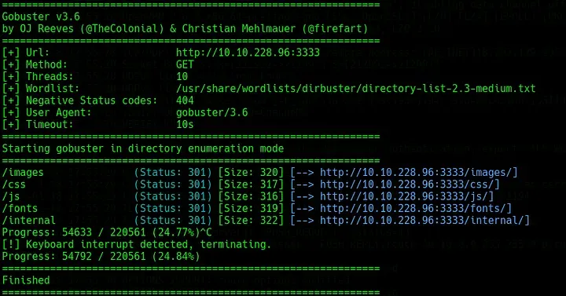
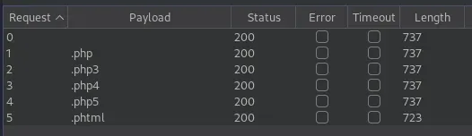
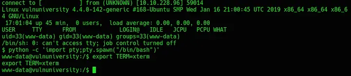
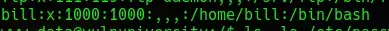
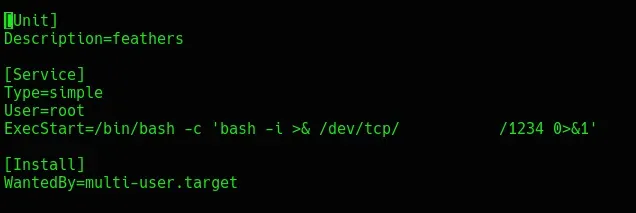
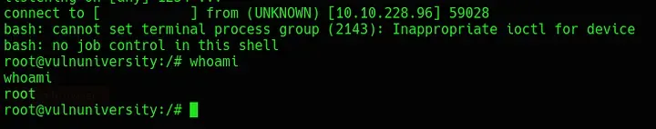

# Vulnversity
# Recon

To begin, run `nmap -sC -sV -vv -oN nmap/init [IP_ADDR]` to identify any open ports or potentially vulnerable services. This scan returns six open ports. A web server is running on port 3333.

Running `gobuster dir -u http://[IP_ADDR]:3333 -w /usr/share/wordlists/dirbuster/directory-list-2.3-medium.txt` reveals a couple of interesting page hits.


*Fig I. Output from the above GoBuster command.*

Of note here are the `/internal` and `/images` directories.

# Exploitation

Following the instructions provided in the room, create a custom word list for the various `.php` extensions. Once this is completed, capture a upload request with Burp Suite and pass it into Intruder. In Intruder, mark the file extension as the payload insertion point and choose the custom word list that was created earlier.

For this to work properly, disable *“Payload Encoding”* at the bottom of the *“Payloads”* tab. Now, when this runs, the `.phtml` extension should return a different *“Length”* than the others, indicating success.


*FIg II. Burp output showing different length for .phtml.*

Now, we can use [this](https://github.com/pentestmonkey/php-reverse-shell/blob/master/php-reverse-shell.php) reverse shell renamed to `php-reverse-shell.phtml` and with the IP address modified to the attacker IP address. After uploading this, run `gobuster -dir -u http://[IP_ADDR]/internal/ -w /usr/share/wordlists/directory-list-2.3-medium.txt` to identify the uploads directory. The uploads directory is `/internal/uploads`.

Next, run `nc -nvlp 1234` and click on or navigate directly to the shell uploaded. This should catch the connection. Once connected, stabilise the shell as below.


*Fig III. Shell stabilisation.*

After this, background the shell with `CTRL-Z` and then run `stty -raw echo; fg` in the attacker terminal. This disables `echo`, kills the current terminal session and finalises stablilisation.

Running `whoami` will show that the current session is being run as user `www-data`. Next, run `cat /etc/passwd` to identify `bill` - the only non-system user.


*Fig IV. The "bill" user shown on terminal.*

The flag for `bill` can be obtained by running `cat home/bill/user.txt`.

# Privilege Escalation

To escalate, the room hints at the use of a SUID bit file. A tool such as [LinEnum](https://github.com/rebootuser/LinEnum) can be used, or a manual search can be performed with:

```bash
find / -perm -u=s -type f 2>/dev/null
```

<br/>Once this runs, a SUID bit is identified in `/bin/systemctl`. The exploit found here can be used to open a reverse shell as root. First, find a writable directory like `/tmp`. In the writable directory, create a file called `root.service` and insert the below code:


*Fig V. The code to be inserted into the root.service file.*

Next, open a listener on the attacking machine using `nc -nvlp 1234` and start the service created by running:

```bash
/bin/systemctl enable /tmp/root.service
/bin/systemctl start root
```

<br/>Once these commands fire, a shell should be received as `root`.


*Fig VI. The final shell as root on the target.*

The final flag can be grabbed using cat /root/root.txt.