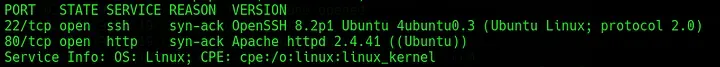
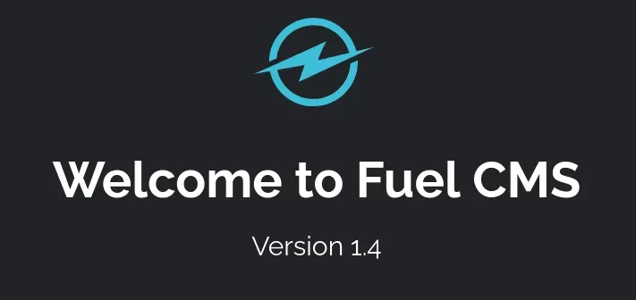
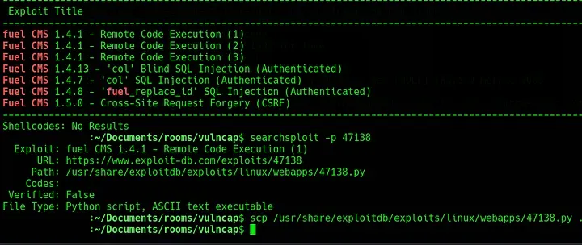
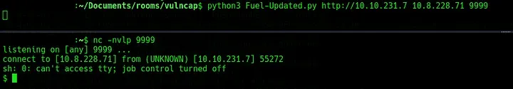

# [Vulnerability Capstone](https://tryhackme.com/room/vulnerabilitycapstone)
# Recon

To begin, run `nmap -sV -vv -oN nmap/init [IP_ADDR]` to identify any open ports or potentially vulnerable services. This scan returns two open ports, one running SSH on port 22 and the other running a web server on port 80.

*Fig I. Results from nmap scan.*

The web server on port 80 is hosting a boilerplate page for “Fuel CMS Version 1.4” and not much else.

*Fig II. Fuel CMS landing page.*

# Exploitation

Run `searchsploit fuel cms` or search online for available exploits for this service. Using `searchsploit` provides the following results:

*Fig III. SearchSploit results for Fuel CMS.*

For this challenge, [this](https://github.com/ice-wzl/Fuel-1.4.1-RCE-Updated) exploit works well. Start a listener on the attacking machine with `nc -nvlp 9999` and then follow the instructions to execute the script. This should return a shell as `www-data` which is enough to get the flag (the challenge instructions give away the flag location).

*Fig IV. The shell gained via the exploit.*