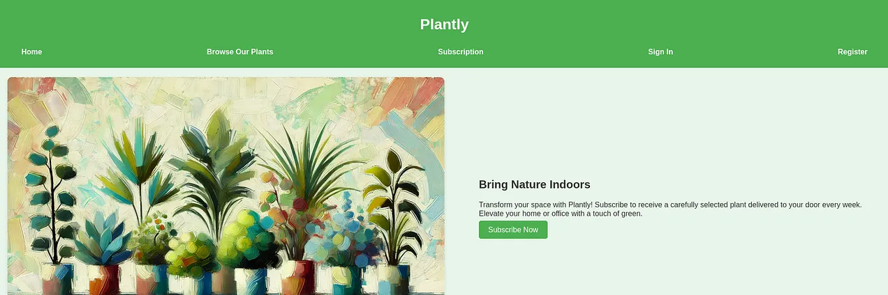
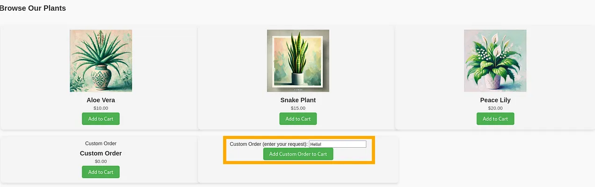
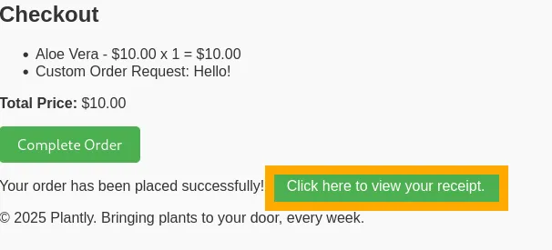
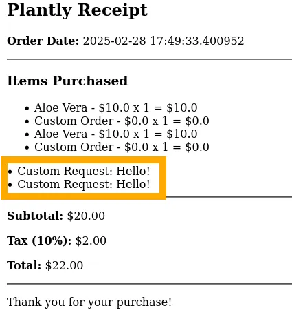
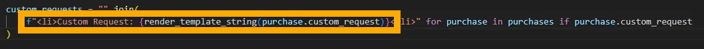
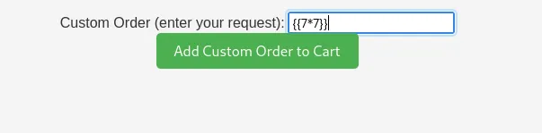
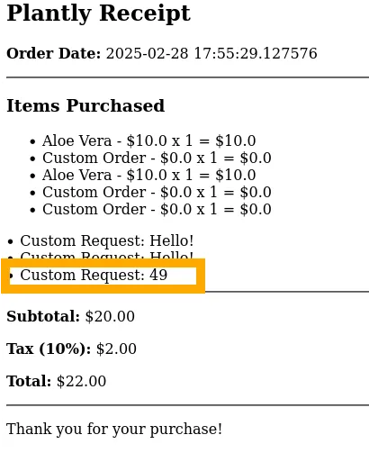
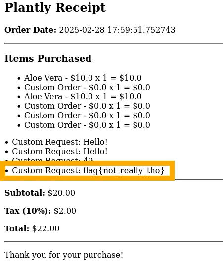

For Plantly, we get access to an online plant store. We’re given two sets of default/example user credentials to login initially and you’re able to register more accounts if needed (which I did because I killed the server more than once, oops).


*Fig I. The landing page for the Plantly website.*

Register yourself an account or sign in with the provided credentials. Heading over to “Browse Our Plans” we see some plants to add to cart, as well as a “Custom Order” field to type into.


*Fig II. The plant options displayed in the "Browse Our Plants" menu.*

If we add this stuff to our cart and proceed to checkout, we’ll see a summary of our order and an option to view a receipt.


*Fig III. The "Checkout" page after adding items to our cart.*

Viewing the receipt shows our “Custom Request” text reflected on the receipt.


*Fig IV. Custom request text reflected on the receipt.*

We have access to the source code for this app, so we can see whats happening. In `store.py` we can see in the receipt our custom request is being rendered as a template by Flask:


*Fig V. The store.py template rendering.*

We know that we can control this input, so lets test. Go back to the store and place a custom order. For your custom order, enter `“{{7*7}}”`.


*Fig VI. Basic SSTI payload test in the "Custom Order" field.*

Add this to your cart, proceed to checkout, and view your receipt. You should notice your new “Custom Request” actually shows the result of calculating 7x7! 


*Fig VII. Confirmation of SSTI on the receipt via "Custom Order" text.*

This demonstrates that the web application is vulnerable to Server Side Template Injection (SSTI). You can read more about SSTI in Jinja2 [here](https://www.onsecurity.io/blog/server-side-template-injection-with-jinja2/) or [here](https://github.com/dgtlmoon/changedetection.io/security/advisories/GHSA-4r7v-whpg-8rx3). Now that we know the app is vulnerable to this, we can craft a simple payload to get the flag:

```python
{{ self.__init__.__globals__.__builtins__.__import__('os').popen('cat flag.txt').read() }}
```

<br/>Go back to the store, insert the above payload as your “Custom Order”, proceed to checkout and view your receipt, you should see your flag displayed as your last “Custom Request”!


*Fig VIII. Local flag example after exploiting the template injection.*