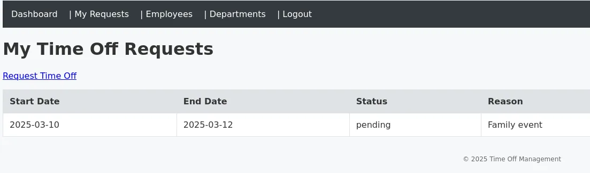
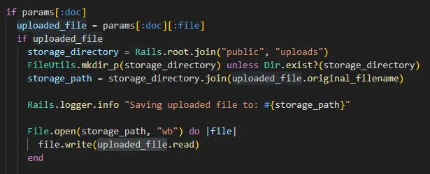
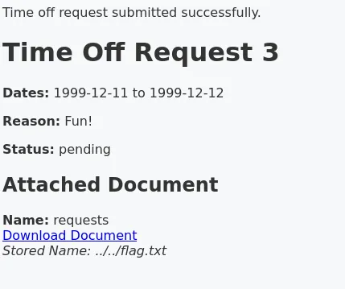
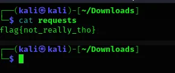

# Time Off

Time Off is a time management system that lets you book holidays. We get given default credentials to login to the app, logging in as the normal user we can see departments, other employees and an option to book time off. 

When we “Request Time Off” we can put our dates, reasoning and upload a document. Interestingly we can pick the file name of the document. If we investigate the source code we can see: 

This create function takes in the name we provided as the file name. So, if we go ahead and name our file `../../flag.txt`, this should write the contents of `flag.txt` to the actual file we upload, whatever it is. 

and then we download our document (my original file was called “requests"). 

Even though the file we download has our original name, it actually contains the file name we specified, in this case our `flag.txt`.