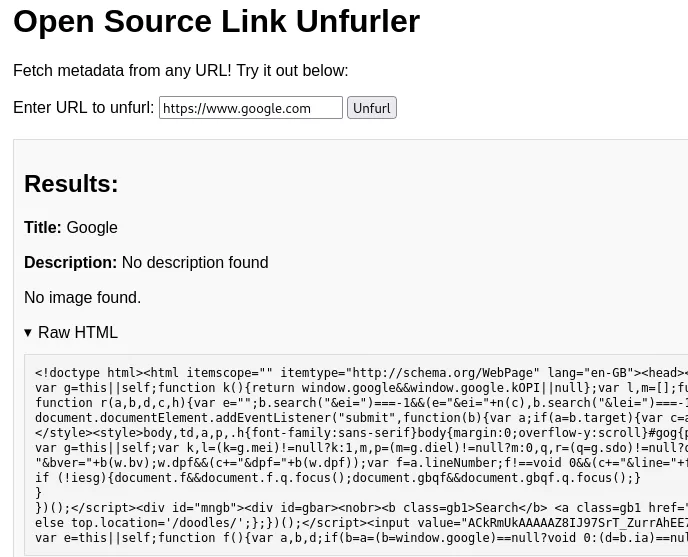
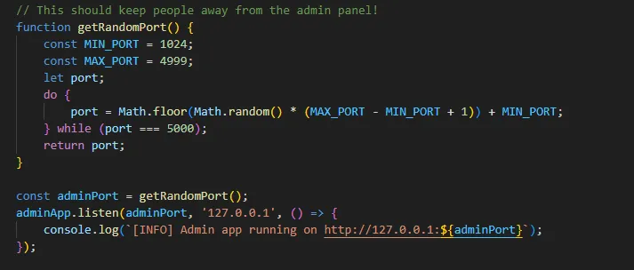
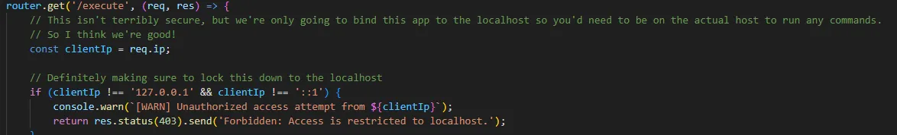
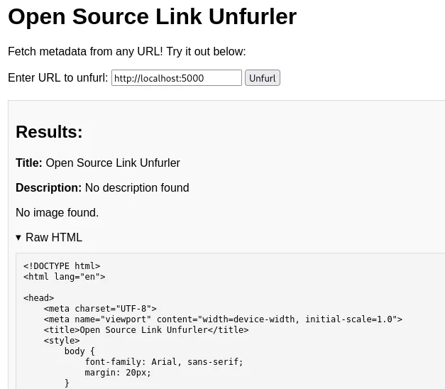
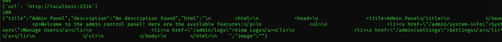
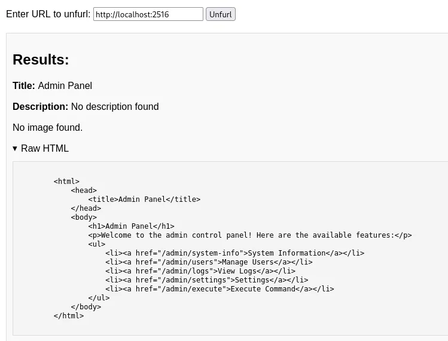
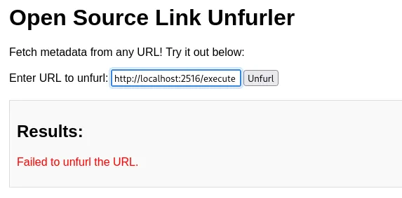
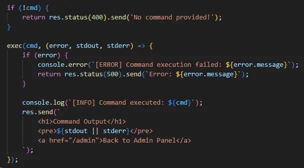
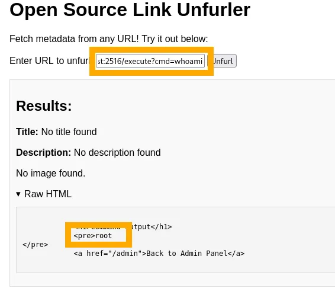
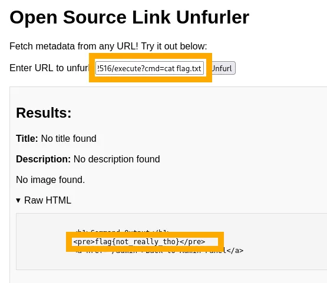

# Unfurl

Unfurl is a web app which fetches the metadata for any URL you provide it. You provide the server with a URL, the server makes a request to that URL, and returns the metadata to you. If we go to the homepage, and ask it to unfurl `https://www.google.com` it does so no problem:<br />



Take a quick look at the source code for this app and notice that its actually running on two different ports, one for the user app, and one for the admin app. In `admin.js` we can see the admin port is a random port between `1024` and `4999`, so manually guessing this won’t be quick.<br />



Taking a look at `publicRoutes.js` we see there’s no restriction on the URL we enter, so we can enter whatever we like. Lastly, if we scroll through the `adminRoutes.js` we see some interesting stuff.<br />



The comments note that access to the admin endpoints, particularly the `/execute` endpoint is restricted to `localhost` only. This is of interest to us, because we can enter any URL into the unfurl homepage. For instance, if we enter `http://localhost:5000`:<br />



This works! This shows this is vulnerable to Server Side Request Forgery (SSRF). This works because we are requesting that the server get the URL `http://localhost:5000`, so this is returning what is running on the actual server. Now that we can request URLs running locally on the server, we need to find out what port the admin site is running on. We know the port range, and we know the URL, so the following simple script can (gently) brute force the admin port:

```
import requests
ports = range(1024, 4999)

headers = {
‘Host’: ‘[url]:[port]’,
‘Content-Type’: ‘application/json’
}
for port in ports:
    json_data = {
    ‘url’: f’http://localhost:{port}’
    }
    response = requests.post(‘[url]:[port]/unfurl’, headers=headers, json=json_data')
    print(json_data)
    print(response.status_code)
    if response.status_code == 200:
        print(response.text)
        break
```

<br />This Python script will iterate through each port from 1024-4999 until it hits a 200 status code, indicating that the admin panel has been found. You should see output like:<br />



Now, we can change our URL to `http://localhost:2516` and see the raw HTML for the admin panel:<br />



The endpoint I’m most interested in is `/execute` but if we try to directly unfurl this we get an error:<br />



If we refer back to the app source code, we can get an idea of how `/execute` should be used.<br />



If we don’t provide `/execute` with a `cmd` we’ll get an error. So modifying our URL to test this:<br />



The app tells us we are root! Getting the flag is now simple, just modify the payload to: `http://localhost:[port]/execute?cmd=cat flag.txt`.<br />

