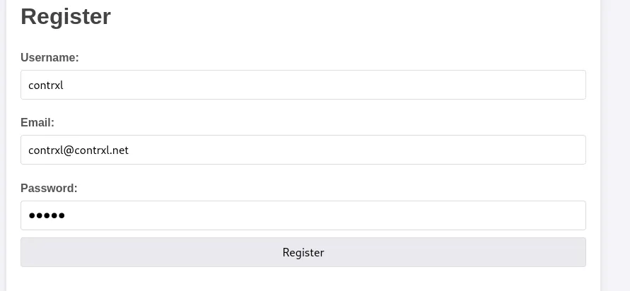
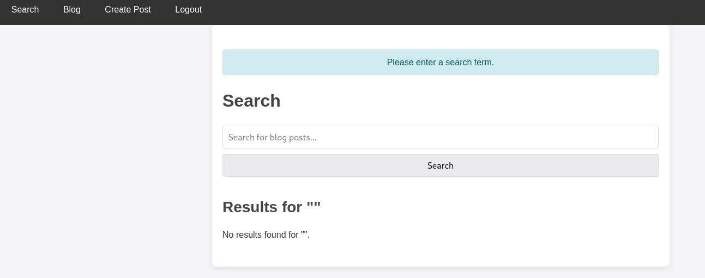
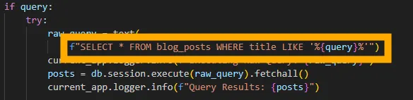
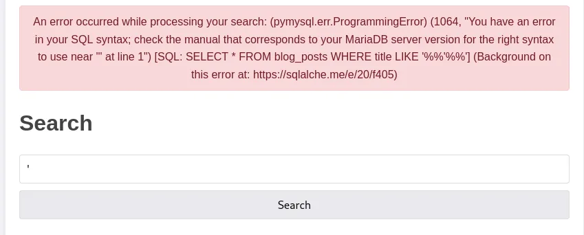
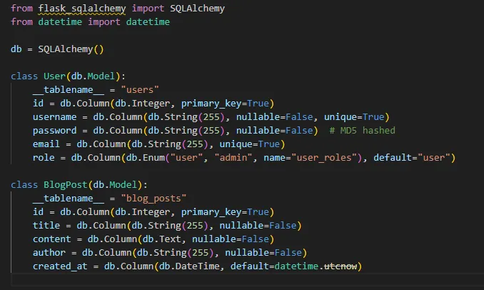
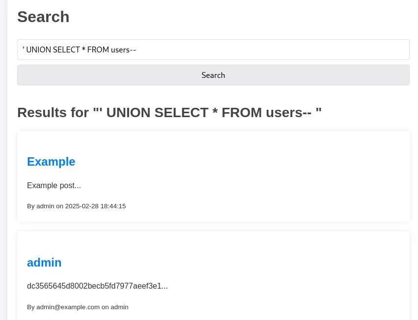
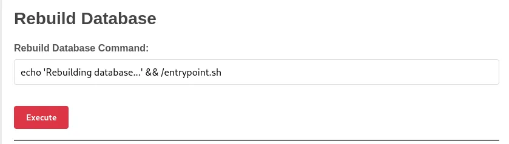
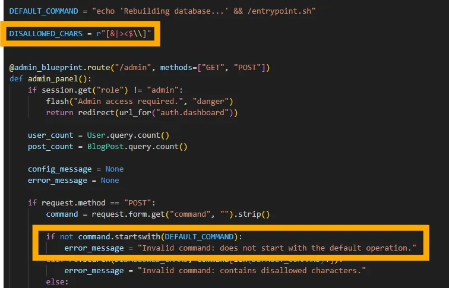
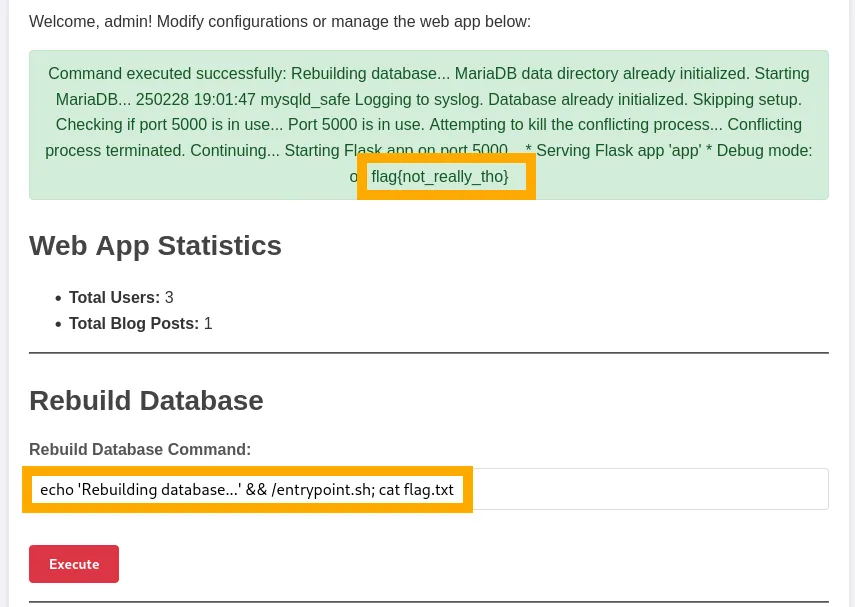

# Weblog

Weblog is a simple blogging app. The homepage has three main functions: “**Login**”, “**Register**” and “**Recover Account**”. First thing to do, is head onto “**Register**” and set yourself up.<br />



Logging in, we can see some new functions: “**Dashboard**”, “**Search**”, “**Blog**” and “**Create Post**”. We’ll go straight for the search function.<br />



If you take a look through the source code for the application, you can see why we go directly for the search function. In `search.py` we can see the line of code which allows us to perform our search:<br />



This dumps our query directly into the SQL query without any sanitisation or checks. We can verify the app is vulnerable by searching for a single apostrophe, which gives us a *very* detailed error.<br />



Now, even without the source, we can see where our input is being injected in the query. Fortunately, because we have the source code for this app, we can skip some enumeration. We know there are two tables, and we know they have the same number of columns. In `models.py` we see:<br />



There’s also a comment here telling us the passwords are MD5 hashed. So we know we’re looking to dump the users table, let’s use `UNION` injection:<br />



Bingo, now we have the MD5 hash for the admin account. I just dumped this into [Crackstation](https://crackstation.net/) to get the password. We can now logout, and login again as admin using their cracked password. We have a new button: “**Admin Panel**”. In there, we can see a “**Rebuild Database Command**” and we can edit it!<br />



However, there are restrictions on this. In the source code under `admin.py` we can see:<br />



We can see here that we’re not allowed to use any `DISALLOWED_CHARS` and the command must start with “`echo ‘Rebuilding database…’ && /entrypoint.sh`”. A notable character that isn’t in the disallowed list is the semi-colon. A semi-colon acts as a command terminator and can separate two commands, so our payload can be:

```bash
echo ‘Rebuilding database…’ && /entrypoint.sh; cat flag.txt
```
<br />



Hit “Execute” and you’ll get the flag returned in the command execution output!