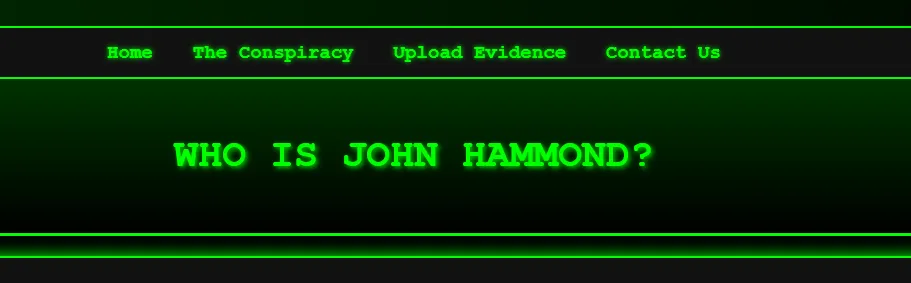
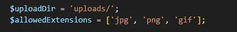
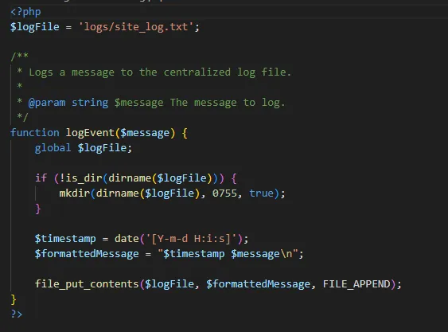
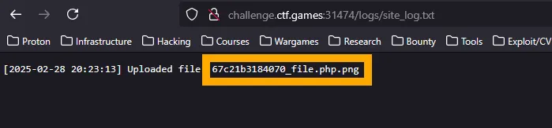
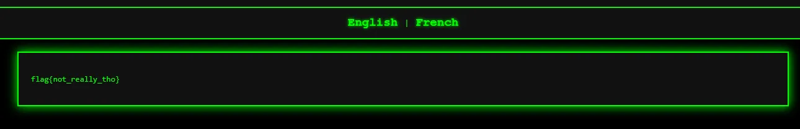

# Who is JH?

Who is JH? Takes us to a page with a bunch of buttons - most importantly “Upload Evidence” & “The Conspiracy”.<br />



From the app source code, we can see that there are some restrictions with what we can upload.<br />



We can see from this, that the file is uploaded to /uploads and that it must be either a jpg, png or gif. Fortunately, that’s all it checks for, so we can create a malicious PHP file with the following:

```php
<?php
$output = file_get_contents(‘../../../../flag.txt’); echo “<pre>$output</pre>”;
?>
```

<br />Name this file something like file.php.png or any of the other valid extensions and it will upload no problem. I’ve used `file_get_contents` because a lot of the other PHP functions are blocked. In the source Dockerfile:<br />


Once uploaded, we need to find out files unique name. In the source code, we can see `log.php`.<br />



If we head to `logs/site_log.txt` we should see our files unique name:<br />



Now that we have this, head into “The Conspiracy” and click on one of the languages. This changes the URL to `?language=languages/french.php`. This allows us to perform file traversal to get our PHP file to run by changing the URL to `?language=uploads/[yourfile]`.<br />

