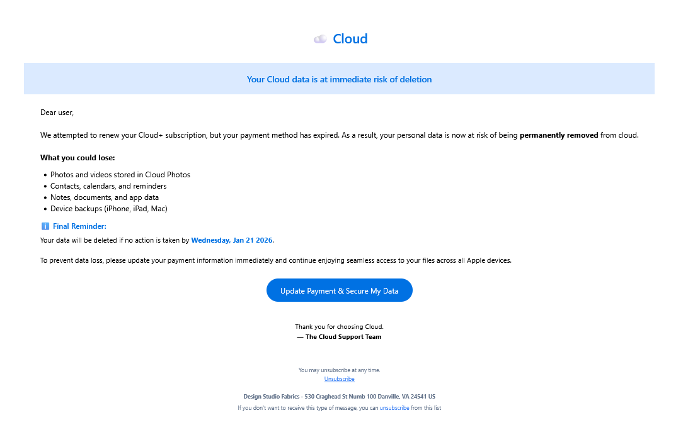
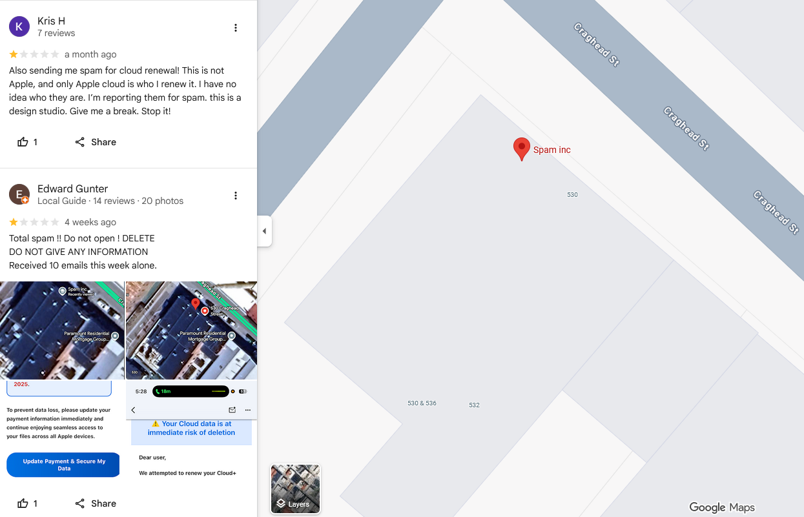
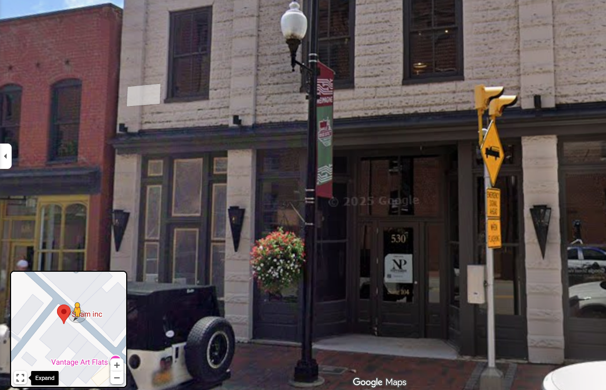
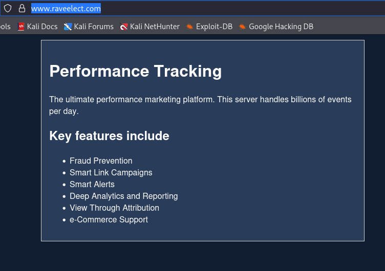
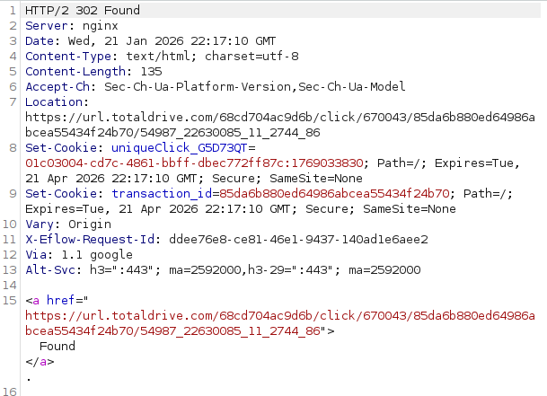
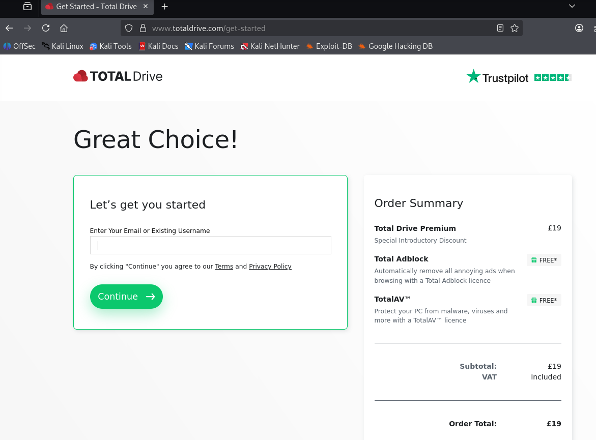

# TotalDrive Phishing Campaign
This month, I observed two unusual emails from clearly suspicious senders. The two emails had the following subject lines:
1. B-ES06KE Community Edition: January Highlights and Insights
2. January Community Edition: Stories That Start with People

 The emails have almost identical bodies. It is immediately obvious that this is an attempt to mimic the legitimate Apple iCloud storage warning email. 

*Fig I. Sample of the mail body from the suspicious emails.*

Both emails claim I am running out of "Cloud+" storage and that I must click the link to update my payment method. They also contain unsubscribe buttons, and a headquarters address for "Design Studio Fabrics". This appears to be a ficticious organisation. 

*Fig II. Google Maps location showing "Spam Inc." at the HQ address for "Design Studio Fabrics"<a href="#1">1</a>.*

*Fig III. "Hue by Nancy Parrish Interiors", the legitimate business that appears to reside at 530 Craghead St.*

# The Redirect Chain
Clicking the link in the email to "Update Payment & Secure My Data" puts me through the following redirect chain:
1. 
hxxp[://][::ffff:334f:4fd4]/qs=r-agggbaekcdkiffbahdbfgkjaddhebbjgagfkjiabagfkjiabajhadccaccafigeadiffafjgfdjadcc

2. 
hxxps[://]www[.]raveelect[.]com/2CRDPFB2J/G5D73QT/?sub1=54987_22630085_11_2744_86&sub2=lAZZjLWTEmTlJqRacaQXTsoLcPNynJQbKLrNdDSXFPqKCJmrLymNkzjuQaytUPFGQi&sub3=86

3. 
hxxps[://]url[.]totaldrive[.]com/68cd704ac9d6b/click/670043/85da6b880ed64986abcea55434f24b70/54987_22630085_11_2744_86

4. 
hxxps[://]www[.]totaldrive[.]com/get-started

The IPv6 address present in the first link translates to the IPv4 address 172[.]241[.]148[.]97. This then redirects you to www[.]raveelect[.]com which presents as "the ultimate performance marketing platform". 

*Fig IV. The front page of www[.]raveelect[.]com*

There are no obvious links or redirects from this page. I was not able to find any information on what RaveElect actually is or how it works. The second part of this URL handles click-tracking and site analytics. Once the request is sent, the following response is observed: 

*Fig V. The response receieved when accessing link two.*

This contains a unique click ID trakcer, a transaction ID, and another redirect to a third site. The third site I am taken to sets up some cookies:
- `FRT:ADVTD`
- `_snsd`
- `FRT:VIS`

 These seem quite unique, so I put the first one into Google and immediately got a hit; the cookie policy page for the "TotalAV" product<a href="#2">2</a>. This page tells me exactly what these do:
- `FRT:ADVTD`: Contains basic visitor entry point information.
- `_snsd`: Contains visitor entry point information to display special introductory discounts.
- `FRT:VIS`: Contains my unique visitor ID.

 The very final redirect lands me on the purchase page for the "TotalDrive" product. 

*Fig VI. The TotalDrive purchase page.*

This does not seem to be the first time Total Security Limited have run a shady marketing campaign like this one<a href="#3">3</a>. There are various mentions of this online, the earliest I found dates back to June 16 2025<a href="#4">4</a>.

# Indicators - Sender Addresses

- Payment/Declined**[at]bartonhillsaustin78704[.]com
- no_replyyxt5yQ3E7kp[at]adventurefishingcharters[.]net

# Indicators - IP Addresses

- 172[.]241[.]148[.]97

# Indicators - URLs

- hxxp[://][::ffff:334f:4fd4]/qs=r-agggbaekcdkiffbahdbfgkjaddhebbjgagfkjiabagfkjiabajhadccaccafigeadiffafjgfdjadcc
- hxxp[://][::ffff:334f:4fd4]/qs=ua-agggbaekcdkiffbahdbfgkjaddhebbjgagfkjiabagfkjiabajhadccaccafigeadiffafjgfdjadcc
- hxxp[://][::ffff:334f:4fd4]/qs=op-agggbaekcdkiffbahdbfgkjaddhebbjgagfkjiabagfkjiabajhadccaccafigeadiffafjgfdjadcc
- hxxp[://][::ffff:acf1:9461]/qs=r-agggbaekcdkiffbahdfdhkjaddhgffdcagfkjiabagfkjiabagjadccaccacbhdadhgbagddkegadcc
- hxxp[://][::ffff:acf1:9461]/qs=ua-agggbaekcdkiffbahdfdhkjaddhgffdcagfkjiabagfkjiabagjadccaccacbhdadhgbagddkegadcc
- hxxp[://][::ffff:acf1:9461]/qs=op-agggbaekcdkiffbahdfdhkjaddhgffdcagfkjiabagfkjiabagjadccaccacbhdadhgbagddkegadcc
- hxxp[://][::ffff:334f:4fd4]/optdown[.]php?n=8
- hxxp[://][::ffff:334f:4fd4]/succeed_unsubscribe[.]php
- hxxps[://]www[.]windowthreerailway[.]com/o-fscs-h72-0fca51d85276a14e7d96471dccf7bf9a

# References

[1] https://maps.app.goo.gl/B3VL8jVBpZR3ZVN49

[2] https://legal.totalav.com/cookie-policy

[3] https://support.google.com/fi/thread/388852962/i-m-getting-emails-from-design-studio-fabrics-regarding-cloud-storage-is-this-legitimate?hl=en

[4] https://support.google.com/fi/thread/388852962/i-m-getting-emails-from-design-studio-fabrics-regarding-cloud-storage-is-this-legitimate?hl=en
