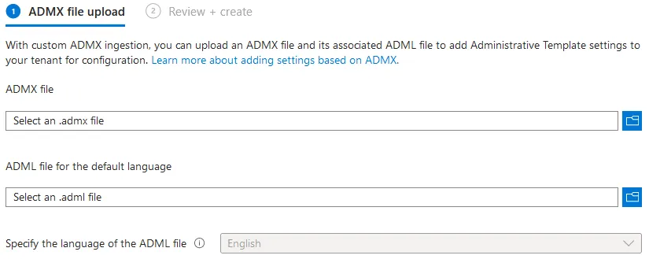

# Intune ADMX Configuration
# Overview
Currently, Intune supports a maximum of twenty uploaded ADMX files. Each file can be up to 1MB. For each ADMX file you import, you may upload a maximum of one ADML file. Each uploaded ADMX file supports one language, at the moment only `en-us` is supported.

ADMX files may have dependency prerequisities which must be imported first. If an ADMX file is missing a dependency, you will receive an error message listing the missing namespace(s). For example, to import the Mozilla Firefox ADMX and ADML files:
- Import `mozilla.admx` and `mozilla.adml`, make sure the status is "Available".
- Import `firefox.admx` and `firefox.adml`.

<br/>If you import `firefox.admx` before you import `mozilla.adml`, you will receive a missing dependency error. To check if your ADMX file has any dependencies, open it in a text editor and look for the string **using prefix** in the `policyNamespaces` node. Note that some files may require `Windows.admx` to be uploaded before they can be used, if this is the case, you will receive the following error:

```xml
ADMX file referenced not found NamespaceMissing:Microsoft.Policies.Windows.
Please upload it first.
```

<br/>To delete a dependency, delete the ADMX file first, then delete the dependency. Using the above example, you would delete `firefox.admx` and then delete `mozilla.admx`.

# Importing ADMX and ADML

Download and save the ADMX templates you wish to import. To import your templates, sign into Microsoft Intune and navigate to **Devices -> Configuration -> Import ADMX -> Import**.<br/>

*Fig I. The ADMX file upload page inside Microsoft Intune.*

On the above page, select the ADMX file you wish to upload, and then upload the ADML file for the default language. Finally, specify the language of the ADML file and wait for the import to complete. Once complete, you will see your templates in the list under **"Import ADMX"**. Here, you can see the upload status of the template, the creation date of the template, the template name and the template version.

# Creating a Profile with ADMX

To create a profile using your imported ADMX, navigate to **Devices -> Configuration -> Create**. Set the platform to **Windows 10 and Later** and choose **Templates -> Imported Administrative Templates (Preview)** as the profile type. 

Now, enter an appropriate name and description on the **Basics** tab then proceed to **Configuration Settings**. Here, choose the settings you wish to configure for your policy.

# Replace an Existing ADMX File

To update an existing ADM file, you have two options:
1. **Replace your existing ADMX File**<br/>
- Delete any profiles using the existing ADMX settings.
- Delete the original ADMX file you imported.
- Import your new ADMX and ADML files.
2. **Create a New ADMX File**<br />
- Create another version of the ADMX file with a different namespace than the original.
- Add the new and different settings to this ADMX file.
- Import your new ADMX and ADML files.