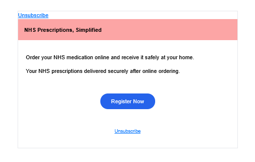
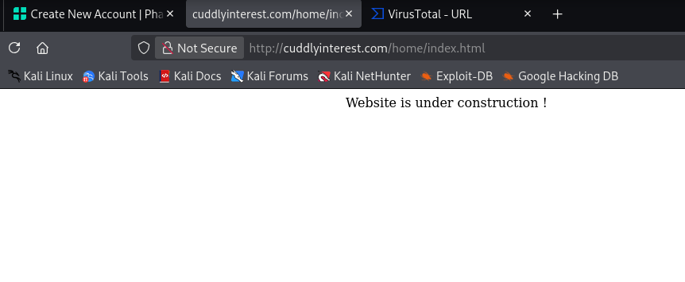
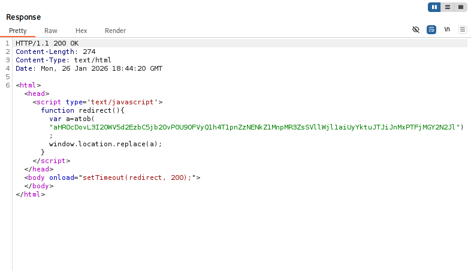
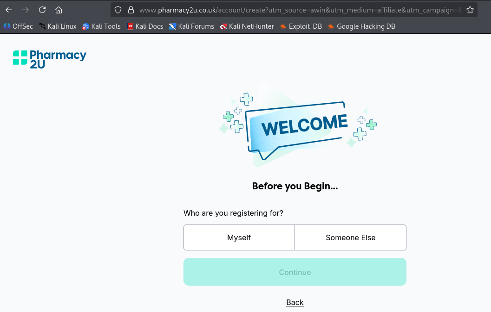
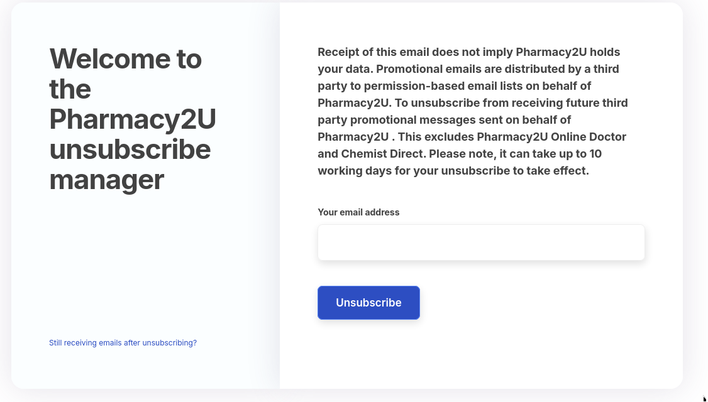
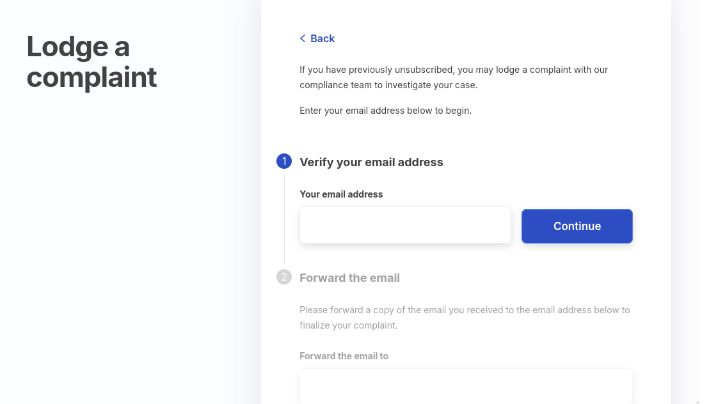

# Pharmacy2U Impersonators Still Trying

Pharmacy2U are known in the UK for getting in a *lot* of trouble<a href="#1">1,</a><a href="#2">2</a>. This happened back in 2015, but it is probably how we have ended up here. 

An influx of mail from scammers/affiliate fraudsters started sometime in 2024<a href="#3">3</a> and continued into last year. I came across a few back then, and they seemed to surge again in the later stages of last year<a href="#4">4,</a><a href="#5">5</a>. The company itself is legitimate, and they seem aware of this ongoing problem<a href="#6">6</a>. Despite this, it seems like it has come round again, and a new set of spam emails from dummy addresses is going around.

*Fig I. The appearance of the spam message.*

# The Redirect Chain

This time, the mail received contained shortlinks, shortened using the shorten[.]rest (formerly short[.]fyi I guess?) service.  The URL shortening thing is probably another rabbit-hole, because while I was trying to find the service used in the mail, I encountered shorten[.]fyi. This has almost exactly the same website front as shorten[.]rest, the only difference is that it advertises as a service for municipalities and government offices, but anyway.

The shortlink takes the user on the following redirect adventure:

1. hxxps[://]short[.]fyi/e3f4/TBJB6bq#t?v=PvxrrOPFee%2biO1kvrW4gIna9%2f4vRwKajLTypH8RN69Xtqv0O5xCY6ItNko%2fpAnCw2mwGPvxEY9DK2ALGigRpn2B182HRJkf94zdGV938bM5GyfWNTO7rex79A9d99VvsSqJZhIWMT0YEBiOuTe%2f9S8hJEJdjUhMBEMgGMcbN6UKD8Uvg6qMQD9MvGJT5r%2fOG7Y0uP6u2cZ21b9qMofxhf4K5TZPbvoLIhjrQyiI%2b%2fX6KWw05bEogSwYSlBGOEU14uAyHPSmKkcL0wqnyFX7w7zyt94YfLYyv3429bQ7CpOsc
2. hxxp[://]cuddlyinterest[.]com/t?v=PYFm6%2fuugzRXNWrWPKTc9ELrJBMiUCiUS698qrfu%2fRtkDo%2bB07WTqE53cE4JX7NysYVhq04W7EEfVOeWbEsjPcSj52OmB60vlvE%2fJgCo%2bJfl%2bHkkSQqFH1Dvbq8%3d
3. hxxp[://]r69eywa3l[.]com/?E=8UrCXxOZgg3D6Fu2zLGvlIYeZ9uj%2bKn%2b&s1=1c0f67be
4. hxxps[://]4tcrlv2lmk[.]com/?E=8UrCXxOZgg3D6Fu2zLGvlIYeZ9uj%2bKn%2b&amp;s1=1c0f67be&amp;ckmguid=2ad6d1e0-4870-4748-8570-e4e3efbfcb56
5. hxxp[://]tracking[.]sendingads[.]com/aff_c?offer_id=363&amp;aff_id=132&amp;url_id=1254&amp;aff_sub=6049&amp;aff_sub2=660789465&amp;aff_sub3=1c0f67be
6. hxxps[://]www[.]awin1[.]com/cread[.]php?awinmid=29989&amp;awinaffid=323075&amp;clickref=355&amp;clickref2=102379854c79566eb77ba3d565ba48&amp;clickref3=363&amp;ued=hxxps%3A%2F%2Fwww[.]pharmacy2u[.]co[.]uk%2Faccount%2Fcreate
7. hxxps[://]www[.]pharmacy2u[.]co[.]uk/account/create?utm_source=awin&utm_medium=affiliate&utm_campaign=&sv1=affiliate&sv_campaign_id=323075&awc=29989_1769453137_098eb20b98686515a8751f045cba015f

Of these many sites, only cuddlyinterest[.]com and awin1[.]com resolve to anything real. The other sites appear to exist solely to tack on extra tracking, or extra affiliate URLs which I assume are generating some form of revenue for the spammers if a user signs up for Pharmacy2U. The cuddlyinterest[.]com domain was registered in October last year, and displays an "in progress" homepage. It might have been registered for this scam, or it could have been hijacked by our budding fraudsters. 

*Fig II. The "In progress" homepage of cuddlyinterest[.]com.*

The response received from this site when requesting it is a little more unusual than the other redirect responses, which makes me think it has been hijacked. The response contains the URL for the r69eywa3l[.]com site in a redirect JavaScript function, and it is Base64 encdoded. This is very unusual considering how transparent the rest of this process is with the redirects.

*Fig III. The base64 encoded URL present in the response from cuddlyinterest[.]com.*

The next site, awin1[.]com, is actually a real site. This offers marketing services and partnerships between advertisers and brands. Presumably this exists here to add on more affiliate links. 

*Fig IV. The Awin[.]com site homepage.*

Finally, you are landed on the legitimate Pharmacy2U sign up page, with a load of affiliate codes and trackers added onto your URL.

*Fig V. The final landing page for Pharmacy2U.*

# Trying to Unsubscribe

Clicking the "Unsubscribe" button launches another redirect chain:

1. hxxps[://]short[.]fyi/e3f4/7l3Uvk9#unsub?v=bS63xjUtCekRybo69WGD8QT08dKmulex%2bXk%2fqkvBPy4MAEHfV%2fdBjRdll0c6DWq0aRDBMCyvNYS5KeuNiPPDssIyguHrz%2bQkMt6m3hy9p13u76HqBYWJF4EJGSdHHJPeqeBNWPSNBIZuU%2bHfe%2fmK1RVx193clRc7vz1pPZPogOKgLTxHyc1mxpIsUur%2bppt5D%2bZ98WPhMjQxx1q2fdOiZRg%3d
2. hxxp[://]cuddlyinterest[.]com/unsub?v=bsrqGDST9qSiDJk%2bju8TaG2DrhW%2bEO%2b95cO4Sclc%2b0QwvK9bUYsjKWF01Fk%2fvCFCJ4w9Czzu5SpWoIOHRn5%2fo9VYEY%2fjC6xHlR1PA1U3avANFbErr7tERHZbknk%3d
3. hxxps[://]www[.]bootbookmars[.]com/o-qfqp-t37-5a70580dc1c38e3841fe88a165d70b86

Interestingly, cuddlyinterest[.]com contains another base64 encoded URL in this chain, although this time it redirects us to www[.]bootbookmars[.]com. This gives us an unsubscribe page.

*Fig VI. The unsubscribe/opt-out page for Pharmacy2U.*

This is very similar to the unsubsrcibe page in my post on [TotalDrive](/blog/TotalDrive), it even has the exact same "Lodge a complaint" page. Slightly different format, but exact same functionality.

*Fig VII. The complaints page for the opt-out system.*

Nothing groundbreaking or unique, but another one to watch out for.

Stay safe out there.

# Indicators - Email

- chaddies5xrtbu@hotmail[.]com

# Indicators - URL

- hxxps[://]short[.]fyi/e3f4/TBJB6bq#t?v=PvxrrOPFee%2biO1kvrW4gIna9%2f4vRwKajLTypH8RN69Xtqv0O5xCY6ItNko%2fpAnCw2mwGPvxEY9DK2ALGigRpn2B182HRJkf94zdGV938bM5GyfWNTO7rex79A9d99VvsSqJZhIWMT0YEBiOuTe%2f9S8hJEJdjUhMBEMgGMcbN6UKD8Uvg6qMQD9MvGJT5r%2fOG7Y0uP6u2cZ21b9qMofxhf4K5TZPbvoLIhjrQyiI%2b%2fX6KWw05bEogSwYSlBGOEU14uAyHPSmKkcL0wqnyFX7w7zyt94YfLYyv3429bQ7CpOsc
- hxxps[://]short[.]fyi/e3f4/7l3Uvk9#unsub?v=bS63xjUtCekRybo69WGD8QT08dKmulex%2bXk%2fqkvBPy4MAEHfV%2fdBjRdll0c6DWq0aRDBMCyvNYS5KeuNiPPDssIyguHrz%2bQkMt6m3hy9p13u76HqBYWJF4EJGSdHHJPeqeBNWPSNBIZuU%2bHfe%2fmK1RVx193clRc7vz1pPZPogOKgLTxHyc1mxpIsUur%2bppt5D%2bZ98WPhMjQxx1q2fdOiZRg%3d
- hxxps[://]short[.]fyi/e3f4/TBJB6bq#t?v=PvxrrOPFee%2biO1kvrW4gIna9%2f4vRwKajLTypH8RN69Xtqv0O5xCY6ItNko%2fpAnCw2mwGPvxEY9DK2ALGigRpn2B182HRJkf94zdGV938bM5GyfWNTO7rex79A9d99VvsSqJZhIWMT0YEBiOuTe%2f9S8hJEJdjUhMBEMgGMcbN6UKD8Uvg6qMQD9MvGJT5r%2fOG7Y0uP6u2cZ21b9qMofxhf4K5TZPbvoLIhjrQyiI%2b%2fX6KWw05bEogSwYSlBGOEU14uAyHPSmKkcL0wqnyFX7w7zyt94YfLYyv3429bQ7CpOsc
- hxxps[://]short[.]fyi/e3f4/7l3Uvk9#unsub?v=bS63xjUtCekRybo69WGD8QT08dKmulex%2bXk%2fqkvBPy4MAEHfV%2fdBjRdll0c6DWq0aRDBMCyvNYS5KeuNiPPDssIyguHrz%2bQkMt6m3hy9p13u76HqBYWJF4EJGSdHHJPeqeBNWPSNBIZuU%2bHfe%2fmK1RVx193clRc7vz1pPZPogOKgLTxHyc1mxpIsUur%2bppt5D%2bZ98WPhMjQxx1q2fdOiZRg%3d
- hxxp[://]cuddlyinterest[.]com/t?v=PYFm6%2fuugzRXNWrWPKTc9ELrJBMiUCiUS698qrfu%2fRtkDo%2bB07WTqE53cE4JX7NysYVhq04W7EEfVOeWbEsjPcSj52OmB60vlvE%2fJgCo%2bJfl%2bHkkSQqFH1Dvbq8%3d
- hxxp[://]r69eywa3l[.]com/?E=8UrCXxOZgg3D6Fu2zLGvlIYeZ9uj%2bKn%2b&s1=1c0f67be
- hxxps[://]4tcrlv2lmk[.]com/?E=8UrCXxOZgg3D6Fu2zLGvlIYeZ9uj%2bKn%2b&amp;s1=1c0f67be&amp;ckmguid=2ad6d1e0-4870-4748-8570-e4e3efbfcb56
- hxxp[://]tracking[.]sendingads[.]com/aff_c?offer_id=363&amp;aff_id=132&amp;url_id=1254&amp;aff_sub=6049&amp;aff_sub2=660789465&amp;aff_sub3=1c0f67be
- hxxps[://]www[.]awin1[.]com/cread[.]php?awinmid=29989&amp;awinaffid=323075&amp;clickref=355&amp;clickref2=102379854c79566eb77ba3d565ba48&amp;clickref3=363&amp;ued=hxxps%3A%2F%2Fwww[.]pharmacy2u[.]co[.]uk%2Faccount%2Fcreate
- hxxps[://]www[.]pharmacy2u[.]co[.]uk/account/create?utm_source=awin&utm_medium=affiliate&utm_campaign=&sv1=affiliate&sv_campaign_id=323075&awc=29989_1769453137_098eb20b98686515a8751f045cba015f
- hxxp[://]cuddlyinterest[.]com/unsub?v=bsrqGDST9qSiDJk%2bju8TaG2DrhW%2bEO%2b95cO4Sclc%2b0QwvK9bUYsjKWF01Fk%2fvCFCJ4w9Czzu5SpWoIOHRn5%2fo9VYEY%2fjC6xHlR1PA1U3avANFbErr7tERHZbknk%3d
- hxxps[://]www[.]bootbookmars[.]com/o-qfqp-t37-5a70580dc1c38e3841fe88a165d70b86

# References

[1] https://www.bbc.co.uk/news/technology-34570720

[2] https://pharmaceutical-journal.com/article/news/pharmacy2u-fined-130000-for-selling-patient-data

[3] https://x.com/GingerNinjas5/status/1820025669297824225

[4] https://www.reddit.com/r/Pharmacy_UK/comments/1o84a3w/relentless_pharmacy2u_spam_are_they_a_real/

[5] https://www.reddit.com/r/ADHDUK/comments/1f4z4w4/can_anyone_confirm_if_this_is_real_i_get_my/

[6] https://www.pharmacy2u.co.uk/beware-of-scams-spam-and-fraud

